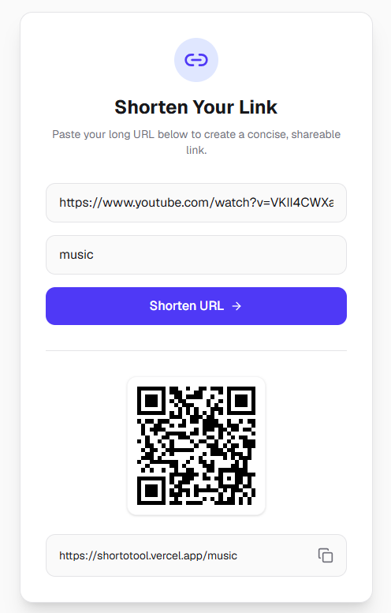

# Shorto - URL Shortener


Shorto is a blazing-fast, modern URL shortener built with Next.js App Router. It allows you to transform long links into concise, shareable shortcodes instantly while providing an automatically generated QR Code.

🔗 **[Live Demo: shortotool.vercel.app](https://shortotool.vercel.app/)**

---

## 📸 Preview

 

---

## ✨ Key Features

- **Instant URL Shortening**: Generates unique, 6-character shortcodes using `nanoid`.
- **Custom Aliases**: Option to provide a custom shortcode of your choice.
- **QR Code Generation**: Automatically generates a QR code for every shortened URL to easily scan on mobile devices.
- **End-to-End Validation**: Strict data validation on both client and server sides using **Zod** and **React Hook Form**.
- **Lightning-Fast Redirects**: Utilizes HTTP 302 redirects for near-instant navigation to the original link.
- **Modern & Minimal UI**: A sleek, responsive, and mobile-friendly user interface built with Tailwind CSS.

---

## 💻 Tech Stack

- **Core:** Next.js (App Router), TypeScript
- **Styling:** Tailwind CSS, Lucide React
- **Database & ORM:** PostgreSQL (Hosted on [Neon.tech](https://neon.tech/)), Prisma
- **Validation:** Zod, React Hook Form
- **Deployment:** Vercel

---

## 🚀 Getting Started

Follow these instructions to set up and run the project locally.

### Prerequisites

- Node.js (v18 or higher)
- npm

### Installation

1. **Clone the repository:**
   ```bash
   git clone https://github.com/tienle2003/shorto.git
   cd shorto
   ```

2. **Install dependencies:**
   ```bash
   npm install
   ```

3. **Environment Setup:**
   Copy the example environment file and create a new `.env` file.
   ```bash
   cp .env.example .env
   ```
   Open the `.env` file and replace the `DATABASE_URL` with your own PostgreSQL connection string.

4. **Initialize the Database:**
   Push the schema to your database and generate the Prisma Client.
   ```bash
   npx prisma db push
   npx prisma generate
   ```

5. **Run the Development Server:**
   ```bash
   npm run dev
   ```
   Open [http://localhost:3000](http://localhost:3000) with your browser to see the application in action.

---

## 📬 Author & Contact

Developed with ❤️ by **Lê Minh Tiến**

- **Điện thoại liên hệ / Zalo:** 0373 635 003
- **GitHub:** [@tienle2003](https://github.com/tienle2003)
- **Facebook:** [Minh Tiên](https://www.facebook.com/lmt4323)